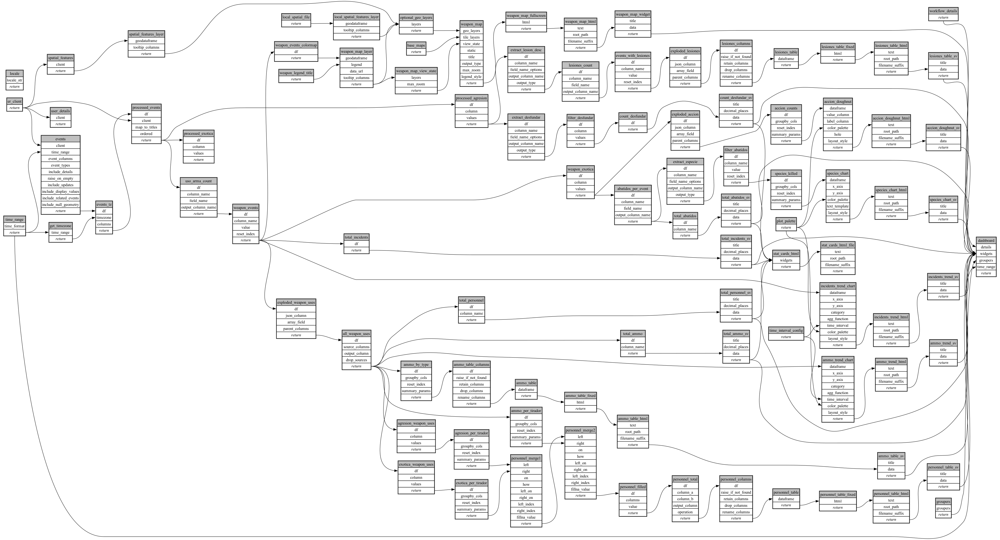

```
# AUTOGENERATED BY ECOSCOPE-WORKFLOWS; see fingerprint in README.md for details

```

```yaml
# fingerprint:
artifacts_sha256_basic: 51920921627f43cb28e15ec1fd123d84145f5db3ddfe6f900469328fe2df8b98
artifacts_sha256_strict: bd9587a39d7e8e117f462b5534b673a83d6d8a42e024611ba55020dd22b1d6ea
installed_requirements:
- channel: https://repo.prefix.dev/ecoscope-workflows/
  name: ecoscope-platform
  version: {version: ==2.17.5}
- channel: https://repo.prefix.dev/ecoscope-workflows-custom/
  name: ecoscope-workflows-ext-custom
  version: {version: ==0.1.0rc23}
- channel: conda-forge
  name: pydeck
  version: {version: ==0.9.2}
- channel: https://repo.prefix.dev/ecoscope-workflows-custom/
  name: ecoscope-workflows-ext-apn
  version: {version: ==0.0.30}
params_sha256: 91572a1ae4d5cd1210f7cd8ca500402e935350ffbaad3551a900dc1a6f0d4421
spec_sha256: 5accdd6352e0446833bbfd107a68023a62532a996f88aeb820e30b756549edad

```

# ecoscope-workflows-weapon-use-workflow


